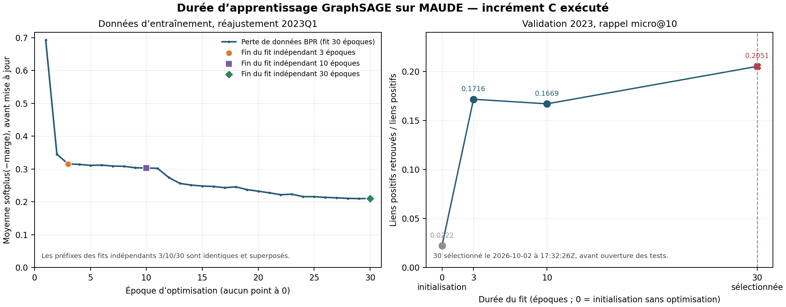

# Diagnostic de durée GraphSAGE sur MAUDE — exécution complète

**Incrément C exécuté le 2 octobre 2026 et techniquement clos.** Le run archivé `results/generated/consolidation-post-RC1/maude-duration-20261002T172405Z/` est complet : 2023 validation, sélection verrouillée, puis tests 2024 et 2025. Le [manifeste public compact](../../../results/maude_duration_diagnostic_20261002T172405Z.json) distingue ces nouveaux entraînements des résultats historiques et de l'audit de sorties conservées ; aucune confirmation indépendante n'est revendiquée.

## Provenance et exécution

- Code : commit `4a22c2addc8203efd2b38a60c416270855c3bf3b`.
- Entrée préparée en lecture seule : `results/generated/consolidation-post-RC1/core-verification-20261002/inputs/HealthGraphBench_RC1/data/real_R6/maude_B/prepared_snapshots.json.gz`, SHA-256 `1cba7f84ff24131715c68a985d9302c96c7bab4a4b2a27d906559a41104fbd36`.
- Protocole effectivement exécuté : copie figée `results/generated/consolidation-post-RC1/maude-duration-20261002T172405Z/experiment_protocol_executed.md`, SHA-256 `69cda4bbd4cd86c3ebbe2346346e2a6292ef69a89699d92e1b628bc504fcb94a`. Elle conserve son statut pré-lancement (« diagnostic non exécuté ») tel qu’il était au gel ; l’exécution ultérieure est attestée séparément par le manifeste et les résumés du run. L’empreinte de cette copie ne doit pas être remplacée par celle du document canonique, actualisé après l’exécution.
- Configuration : GraphSAGE à un saut, dimension 8, échantillonnage de 8 voisins, taux d’apprentissage 0,02, régularisation 0,0005, objectif BPR, activation `tanh`. Fits indépendants, sans warm-start, grille 0/3/10/30 ; négatifs, initialisation, historique et classement gardent les règles fixées.
- Fit de validation sur l’histoire jusqu’à 2022Q4 au réajustement 2023Q1 ; les représentations apprises restent fixes pendant les quatre trimestres de validation.
- Le manifeste brut et les résumés consignent le run, les empreintes, statuts et horodatages (17:24:23–17:43:51 UTC), sans capturer automatiquement l'`argv`. Le manifeste compact conserve la commande réelle consignée au lancement dans la session, avec cette provenance distincte ; elle ne remplace pas les preuves physiques du run.
- Rendu reproductible réellement exécuté depuis la racine du dépôt avec Python 3.13.5 / Matplotlib 3.10.8 :

  ```sh
  results/generated/consolidation-post-RC1/core-verification-20261002/analysis-env/bin/python results/generated/consolidation-post-RC1/maude-duration-20261002T172405Z/postprocessing/render_maude_duration.py
  ```

  Ce script local ne fait que lire les sorties JSON/JSONL gzip, contrôler les dénominateurs, puis produire le CSV et les figures. La grille complète des pertes d’époque (fits 2023 et réajustements tests) et les champs de provenance/coût figurent dans [`results/maude_duration_epochs_20261002T172405Z.csv`](../../../results/maude_duration_epochs_20261002T172405Z.csv).

## Validation 2023 et pertes observées

Le critère est le rappel micro@10 au seuil de soutien produit 1 : hits sur **7 705 liens positifs**, sur 3 483 observations produit–trimestre avec positif et 1 618 588 paires candidates, identiques pour chaque durée. La perte enregistrée est la moyenne de `softplus(−marge)` sur les triplets visités **avant mise à jour** ; elle exclut la régularisation et n’est pas l’objectif pénalisé complet. Chaque époque visitait 67 676 triplets, sans positif sauté. À 0 époque, aucun triplet n’est optimisé : sa perte n’est donc pas zéro mais **non observée**.

| Époques | Rappel micro@10 validation (hits / 7 705 liens) | Perte BPR, époque 1 → dernière | Temps fit mur / CPU (s) | Pas / triplets visités |
|---:|---:|---:|---:|---:|
| 0 | 0,0221933809 (171/7 705) | — (aucune optimisation) | 0,848 / 0,845 | 0 / 0 |
| 3 | 0,1715768981 (1 322/7 705) | 0,6927517691 → 0,3154040167 | 28,578 / 28,163 | 203 028 / 203 028 |
| 10 | 0,1669046074 (1 286/7 705) | 0,6927517691 → 0,3033096208 | 92,373 / 92,026 | 676 760 / 676 760 |
| **30** | **0,2050616483 (1 580/7 705)** | **0,6927517691 → 0,2102084021** | 272,092 / 269,570 | 2 030 280 / 2 030 280 |

La sélection était limitée à 3/10/30 ; le maximum de validation a verrouillé **30 époques à 17:32:26.207893Z**, avec `test_scores_consulted=false`. Le témoin 0 n’était pas admissible. La courbe montre des observations mesurées, pas une valeur artificielle à l’époque zéro ; les préfixes des trois fits indépendants 3/10/30 sont identiques dans les journaux.



[Version SVG vectorielle](maude_duration_epochs_20261002T172405Z.svg) · [PNG](maude_duration_epochs_20261002T172405Z.png).

## Tests historiques après verrouillage

La durée sélectionnée a été réajustée à 30 époques séparément à 2024Q1 et 2025Q1, puis évaluée trimestriellement avec mise à jour de l’historique entre trimestres. Rappel micro@10 = hits / liens positifs ; les candidats et dénominateurs restent ceux des résumés produits.

| Période | Rappel micro@10 (hits / liens positifs) | Produits–trimestres avec positif | Paires candidates |
|---|---:|---:|---:|
| 2024 | 0,2008995502 (1 206/6 003) | 2 950 | 1 367 736 |
| 2025 | 0,2187979361 (1 569/7 171) | 3 420 | 1 607 420 |
| **2024–2025 regroupé** | **0,2106421740 (2 775/13 174)** | **6 370** | **2 975 156** |

Le rappel regroupé est le rapport des hits et liens additionnés, non la moyenne non pondérée des deux rappels annuels. Le regroupement contient uniquement des observations ayant au moins un positif.

## Coûts effectivement mesurés

Le plafond appliqué était **900 s, 512 MiB RSS agrégée et 512 MiB de sorties par phase** ; la RSS conservatrice additionne RSS courante du contrôleur et `VmHWM`/RSS du worker avec scrutation à 50 ms. Chaque phase reste sous ses trois plafonds. Les durées cumulées de phase ne sont **pas** soumises à une limite globale de 900 s.

| Phase | Temps mural / CPU worker (s) | Pic RSS agrégé (octets) | Sorties de phase (octets) |
|---|---:|---:|---:|
| Validation 2023 (grille complète) | 482,360 / 478,759 | 249 405 440 | 116 627 455 |
| Test 2024 | 329,318 / 327,364 | 235 630 592 | 24 442 575 |
| Test 2025 | 356,214 / 354,860 | 238 419 968 | 28 668 881 |
| Total des phases (sans plafond global) | 1 167,892 | — | — |

Le temps mural total du run est 1 167,908 s ; le CPU worker total 1 160,983 s. Le pic RSS agrégé maximal est 249 405 440 octets. Les checkpoints gardent l’état des paramètres et les éléments d’inférence, mais `resume_supported=false` : ce ne sont pas des états de reprise d’optimisation.

## Vérification des sorties conservées

L'audit numérique post-exécution lit les listes originales et les tables compressées, dérive l'éligibilité et les premières relations depuis l'entrée préparée, puis reconstruit l'inférence à partir des paramètres bruts de **six checkpoints**, sans utiliser les représentations exportées comme réponses.

- **24 trimestres-fit**, 20 302 listes candidates et **9 449 508 lignes de prédiction** entièrement contrôlés : ids, empreintes, labels, rangs et scores. Aucun échantillonnage des scores ; cette somme compte les quatre fits de validation séparément, pas des paires toutes distinctes.
- 24 tables trimestrielles, six tables de phase et le test regroupé recalculés ; **aucun écart détecté**. Entiers, listes et SHA-256 exacts ; comparaisons flottantes à tolérance absolue `1e-12`.
- Logs de **103 époques**, pas/sauts, configurations, préfixes de pertes 3/10/30, états finaux et ressources contrôlés. L'ordre sélection → tests est étayé par les traces et leurs dates de création du système de fichiers local ; les lignes de trace n'ont pas d'horodatage absolu, et ce n'est pas une attestation externe.
- Audit effectué en **71,072 s**, RSS maximale **506 212 352 octets**, sous ses plafonds 900 s / 512 MiB. Rapport détaillé et script reproductible locaux : `postchecks/numeric_invariants.json` et `postchecks/audit_numeric_invariants.py` dans le run ; leurs empreintes et le résumé vérifié figurent dans le manifeste public.

Cette vérification établit la cohérence des sorties C avec les instantanés préparés et les checkpoints, pas une validation indépendante des sources FDA, un effet de couverture ou une robustesse statistique.

## Lecture et limites

Dans la source historique canonique [`results/benchmark_summary_v0_2.csv`](../../../results/benchmark_summary_v0_2.csv), GraphSAGE historique **à 3 époques** vaut 0,1728404433 en rappel@10 (2024Q1–2025Q4) ; `neighbor_frequency` vaut 0,1920449370. Le nouveau run rapporte 0,2106421740 pour la durée 30 sélectionnée, soit des contrastes descriptifs de +0,0378017307 et +0,0185972370. Le score historique à 3 époques reste un fait, mais ne décrit pas le nouveau modèle à 30 époques : les tests du run C n’ont pas évalué de GraphSAGE à 3 époques. Aucun résultat historique n’a été modifié.
La comparaison entre le score GraphSAGE historique à 3 époques et le nouveau test à 30 époques est donc croisée, pas un contraste expérimental 3-vs-30 sur les tests.

Ceci est une réanalyse exploratoire de périodes déjà consultées, **pas une confirmation indépendante**. Ces chiffres ne démontrent ni optimum, convergence, effet causal de la durée, significativité statistique, budgets de calcul équivalents, ni supériorité générale. Aucun nouvel intervalle de confiance, bootstrap, ablation, stratification ou tuning n’a été ajouté.

Les instantanés préparés exposent `quarter`, soutien des produits et relations produit–problème uniques ; fabricants, multiplicités d’arêtes et autres champs absents du `DataBundle` n’ont pas été reconstruits. Les dates sont celles de `DATE_RECEIVED` préparées, sans preuve de disponibilité publique historique. Les seules populations positives ne donnent ni précision ni charge générale, notamment sur les observations sans positif. Les gardes D/E/F et les questions aux auteurs restent ouvertes.
